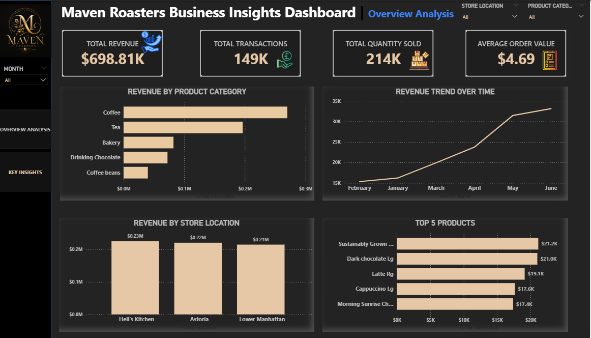

# ☕ Maven Roasters Sales & Customer Analytics Dashboard

A data analytics project focused on understanding sales performance, customer behavior, and product trends for a coffee retail business. The goal is to generate actionable insights that support revenue growth, operational efficiency, and customer targeting strategies.

## 📌 Project Objective

To analyze sales data from Maven Roasters in order to:
- Identify top-performing products and categories  
- Track revenue trends over time  
- Understand customer purchasing behavior  
- Evaluate store performance across locations  
- Provide data-driven business recommendations  

## 📊 Dashboard Preview

> Built using Power BI to visualize sales performance, product trends, and customer insights.

## 🛠 Tools & Technologies

- Power BI (Data Visualization & Dashboarding)  
- SQL (Data extraction and analysis)  
- Excel (Data cleaning and preprocessing)  

## 📈 Key Business Insights

### 1. Strong Overall Business Performance
The business recorded:
- **$698.81K revenue**
- **149K transactions**
- **214K products sold**

This indicates a high customer base and consistent sales activity.

### 2. Coffee is the Dominant Product Category
Coffee outperformed all other categories:
- Tea  
- Bakery  
- Drinking Chocolate  

👉 This confirms coffee as the primary revenue driver.

### 3. Revenue Growth with Seasonal Dip in February
- Steady growth from **January to June**
- Noticeable **decline in February**

👉 Suggests potential seasonal demand variation or reduced marketing activity.

### 4. Store Performance Analysis
- **Hell’s Kitchen** → Highest revenue contributor  
- **Astoria** → Second highest performer  
- **Lower Manhattan** → Lowest among the three  

👉 Location significantly impacts sales performance.

### 5. Customer Preference for Premium Products
Top-performing items:
- Latte  
- Cappuccino  
- Dark Chocolate drinks  

👉 Customers show preference for premium beverage options.

### 6. Average Order Value (AOV)
- **$4.69 per order**

👉 Most customers purchase a single drink per visit, indicating opportunity for upselling.

## 💡 Business Recommendations

- Increase marketing focus on **coffee products**, especially best sellers  
- Investigate and address the **February sales drop**  
- Implement **combo offers and upselling strategies** to increase AOV  
- Optimize staffing during peak sales hours  
- Strengthen performance strategies for lower-performing locations  
- Promote premium drinks to increase revenue per transaction  
